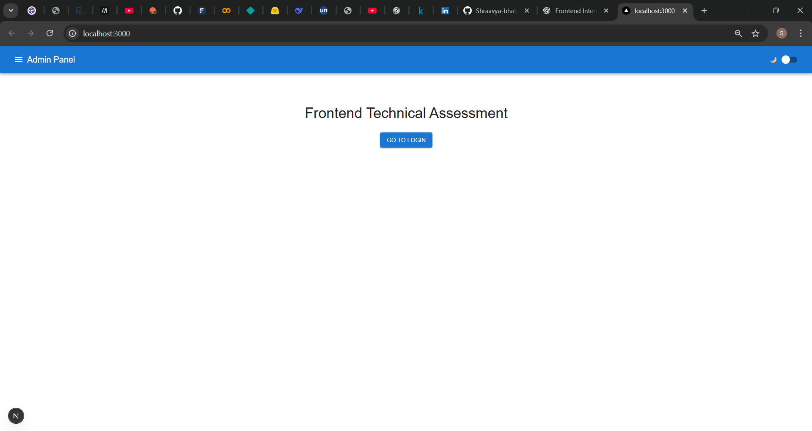
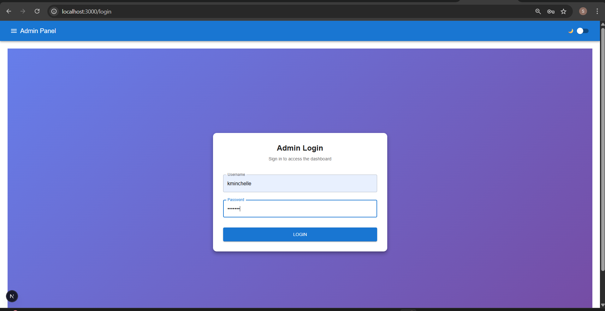
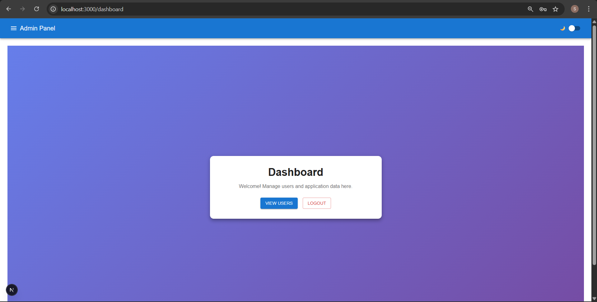
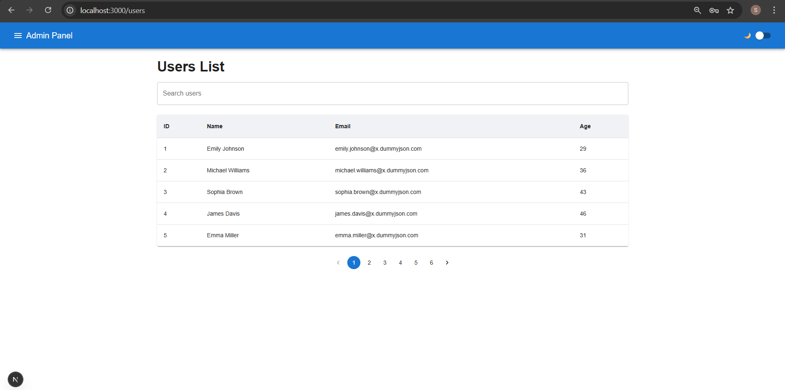

# Frontend Technical Assessment

A frontend technical assessment built using **Next.js (App Router)**, **Material UI (MUI)**, and **Zustand** for state management.

---

## Tech Stack

- Next.js (App Router)
- React
- Material UI (MUI)
- Zustand (State Management)
- DummyJSON API

---

## Authentication

- Admin login implemented using DummyJSON authentication API  
- Authentication state managed using Zustand  
- Dashboard route protected  
- Logout functionality implemented  

### Test Credentials
```txt
Username: kminchelle
Password: 0lelplR
```
Note: DummyJSON API may be inconsistent during development.

A frontend fallback mechanism is used to ensure smooth demo functionality.

## Features

-Home page with navigation to login

-Admin login page

-Protected dashboard

-Users list page with API integration

-Clean and responsive UI using Material UI

-Client-side routing using Next.js App Router

## Users List
```txt
Data fetched from: https://dummyjson.com/users
Displayed using Material UI Table
```
Columns:

User ID

Full Name

Email

Age

## How to Run Locally
```txt
npm install
npm run dev
```

## Open in browser:
```txt
http://localhost:3000
```

## Routes

/ – Home

/login – Admin Login

/dashboard – Protected Dashboard

/users – Users List

## Notes

Authentication is handled on the client side for demonstration purposes

Focus of this project is frontend architecture, UI, routing, and state management

## Screenshots

## 📸 Screenshots

### Home Page


### Login Page


### Dashboard


### Users List



## Thankyou.
